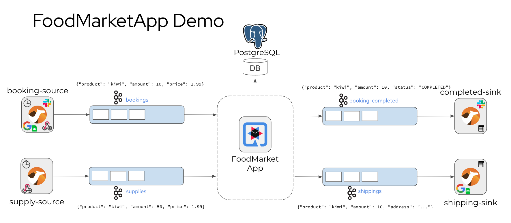

# Kamelets Demo

This project uses Quarkus to implement a sample event-driven application and shows how to add Kamelets as event sources and sinks to connect the application to the world.

## Objectives

The project uses the Quarkus test framework to set up a dev services environment with JUnit Jupiter where the application is running on the localhost.
The Quarkus dev services capabilities will automatically start Testcontainers during the test in order to simulate the surrounding infrastructure
(PostgreSQL database and the Kafka message broker).

If you want to learn more about Quarkus, please visit its website: [https://quarkus.io/](https://quarkus.io/).

## Quarkus sample application

The Quarkus sample demo application is a food market event-driven application that listens for incoming events of type `booking` and `supply`.



Users are able to add booking events. Each of them references a product and gives an amount as well as an accepted price in a simple Json object structure.

```json
{ "client": "citrus-test", "product": "Pineapple", "amount":  100, "price":  0.99 }
```

At the same time suppliers may add their individual supply events that again reference a product with an amount and a selling price.

The Quarkus application consumes both event types and as soon as bookings and supplies do match in all criteria the food market application will produce booking-completed and shipping events as a result.

All events are produced and consumed with Kafka event streams.
The domain model objects with their individual status are stored in a PostgreSQL database.

## Running the tests

In an automated integration test we need to make sure that all events are processed properly and that the resulting booking-completed and shipping events are produced as expected. This is why the Citrus test will produce booking and supply events and listen for booking-completed and shipping events accordingly.

The test is an arbitrary JUnit Jupiter unit test that uses the `@QuarkusTest` annotation in order to enable the Quarkus dev services test capabilities.
Quarkus will automatically start Testcontainers for the test that represent the PostgreSQL database and the Kakfa message broker.

On top of that the test also uses the [Citrus test framework](https://citrusframework.org) to send and receive the different events (booking, supply, shipping, booking-completed)

As already mentioned Quarkus test framework uses JUnit Jupiter as a test driver.
This means you can run the tests just like any other JUnit test (e.g. from your Java IDE, with Maven).

```shell
./mvnw test
```

The Citrus test capabilities are added on top of `@QuarkusTest` with the `@CitrusSupport` annotation.
So you will not need any other configuration to empower the tests with Citrus.

## Running the application in dev mode

You can run your application in dev mode that enables live coding using:
```shell
./mvnw compile quarkus:dev
```

> **_NOTE:_**  Quarkus now ships with a Dev UI, which is available in dev mode only at http://localhost:8080/q/dev/.

## Packaging and running the application

The application can be packaged using:
```shell
./mvnw package
```
It produces the `quarkus-run.jar` file in the `target/quarkus-app/` directory.
Be aware that it’s not an _über-jar_ as the dependencies are copied into the `target/quarkus-app/lib/` directory.

The application is now runnable using `java -jar target/quarkus-app/quarkus-run.jar`.

If you want to build an _über-jar_, execute the following command:
```shell
./mvnw package -Dquarkus.package.type=uber-jar
```

The application, packaged as an _über-jar_, is now runnable using `java -jar target/*-runner.jar`.

## Creating a native executable

You can create a native executable using: 
```shell
./mvnw package -Dnative
```

Or, if you don't have GraalVM installed, you can run the native executable build in a container using: 
```shell
./mvnw package -Dnative -Dquarkus.native.container-build=true
```

You can then execute your native executable with: `./target/kamelets-quarkus-demo-1.0.0-runner`

If you want to learn more about building native executables, please consult https://quarkus.io/guides/maven-tooling.

## Building an image

This is meant to produce a Knative image, to be pushed to quay.io. Update the application.properties to use your own repository.

To build your image, run:
```shell
./mvnw package -Dquarkus.container-image.build=true
```

You can push your image using:
```shell
docker push quay.io/{YOUR_USERNAME}/food-market-demo:1.0.0
```

## Related Guides

- Camel Core ([guide](https://camel.apache.org/camel-quarkus/latest/reference/extensions/core.html)): Camel core functionality and basic Camel languages: Constant, ExchangeProperty, Header, Ref, Simple and Tokenize
- Camel Kafka ([guide](https://camel.apache.org/camel-quarkus/latest/reference/extensions/kafka.html)): Sent and receive messages to/from an Apache Kafka broker
- SmallRye Reactive Messaging - Kafka Connector ([guide](https://quarkus.io/guides/kafka-reactive-getting-started)): Connect to Kafka with Reactive Messaging
- Apache Kafka Streams ([guide](https://quarkus.io/guides/kafka-streams)): Implement stream processing applications based on Apache Kafka

## Provided Code

### Reactive Messaging codestart

Use SmallRye Reactive Messaging

[Related Apache Kafka guide section...](https://quarkus.io/guides/kafka-reactive-getting-started)
